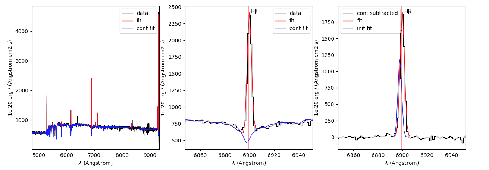
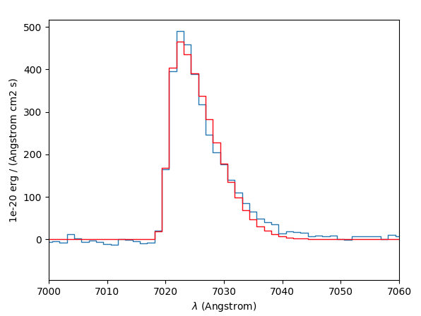
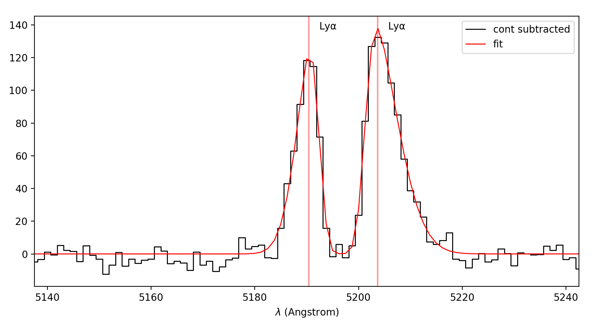
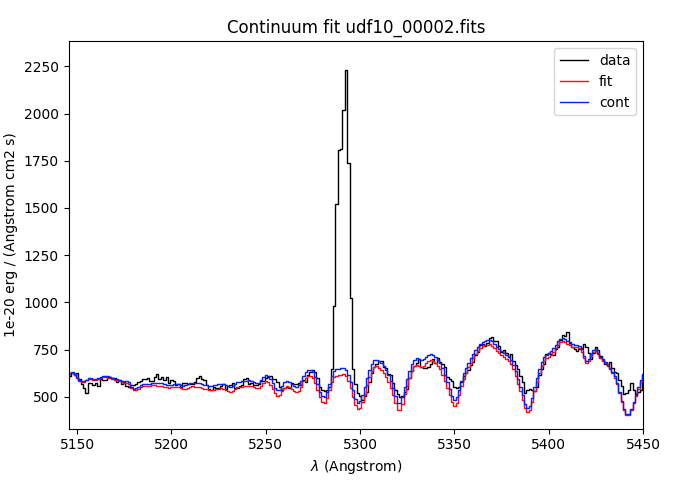
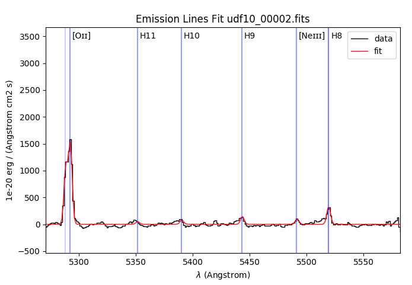

Tutorial
========

This tutorial show how to use pyplatefit to perform continuum and emission line
fit.

.. _basic:

Basic usage
+++++++++++

.. code::

   from pyplatefit import fit_spec
   from mpdaf.obj import Spectrum
   sp = Spectrum('test_data/udf10_00002.fits')
   z = 0.41892
   res = fit_spec(sp, z)
   
::

	[DEBUG] Performing continuum and line fitting
	[DEBUG] Preparing data for fit
	[DEBUG] Getting lines from get_lines...
	[DEBUG] 21.3 % of the spectrum is used for fitting.
	[DEBUG] Initialize fit
	[DEBUG] Found 2 non resonnant line families to fit
	[DEBUG] Init Fit of family forbidden
	[DEBUG] Found 13 lines to fit
	[DEBUG] added 13 gaussian to the fit
	[DEBUG] Init Fit of family balmer
	[DEBUG] Found 9 lines to fit
	[DEBUG] added 9 gaussian to the fit
	[DEBUG] Found 0 resonnant line families to fit
	[DEBUG] Fitting of Line Family: forbidden
	[DEBUG] Leastsq fitting with ftol: 1e-06 xtol: 1e-04 maxfev: 1000
	[DEBUG] Fit succeeded. after 164 iterations, redChi2 = 255.486
	[DEBUG] Fitting of Line Family: balmer
	[DEBUG] Leastsq fitting with ftol: 1e-06 xtol: 1e-04 maxfev: 1000
	[DEBUG] Fit succeeded. after 73 iterations, redChi2 = 249.367
	[DEBUG] Saving forbidden results to tablines and ztab
	[DEBUG] Saving balmer results to tablines and ztab

By default the program perform independant fit for each line family. In this case, the
fit was performed for the Balmer and Forbidden families with respectively 9 and 13
emission lines.
A unique velocity offset (and corresponding redshift) an velocity dispersion is fitted
for all the lines of the same family. See section :ref:`emlines`. for more details.

.. note::

   It is possible to use directly the ``sp.fit_lines()`` method to get the same
   results without the need to import pyplatefit.
   
.. code::

   from mpdaf.obj import Spectrum
   sp = Spectrum('test_data/udf10_00002.fits')
   z = 0.41892
   res = sp.fit_lines(z)
   
The ``res`` dictionary contains all the fit results. Consult the API documentation
for the full description at `pyplatefit.fit_lines`.

The astropy tables lines and ztable are indexed respectively by LINE (line name) and FAMILY (line family name).
For example to access the result of lines for LYALPHA, one can use :

.. code::

   row = res['lines'].loc['LYALPHA']

Let's first display a summary of the fit results by family:

.. code::

   res['ztable'].pprint_all()
   
::

	  FAMILY   VEL  VEL_ERR    Z     Z_ERR    Z_INIT VDISP VDISP_ERR   LINE  SNRMAX SNRSUM SNRSUM_CLIPPED  NL NL_CLIPPED NFEV RCHI2
	--------- ----- ------- ------- -------- ------- ----- --------- ------- ------ ------ -------------- --- ---------- ---- ------
	forbidden 92.48    5.29 0.41923 1.76e-05 0.41892 66.64      6.07 OII3729  13.94  16.92          20.69  13          6  164 255.49
   	balmer 	  82.14    3.86 0.41919 1.29e-05 0.41892 66.11      4.26   HBETA  20.63  13.28          12.97   9          5   73 249.37

As we can see the velocity offset is slightly different for the Balmer and Forbidden
lines. The columns SNRMAX, SNRSUM and SNRSUM_CLIPPED are useful information to decide
on the relevance of the fit.

.. Note::

   Redshift are given in vacuum and all given values are given in rest frame, except
   if specified. The velocity dispersion is the intrinsic value, corrected by the
   instrumental LSF, except if the option ``lsf=False`` is used.

In this specific case the two families given similar results and it can be useful to 
fit all lines simultaneously.

.. code::

   res = sp.fit_lines(z, fit_all=True)
   res['ztable'].pprint_all()

::

	[DEBUG] Performing continuum and line fitting
	[DEBUG] Preparing data for fit
	[DEBUG] Getting lines from get_lines...
	[DEBUG] 21.3 % of the spectrum is used for fitting.
	[DEBUG] Initialize fit
	[DEBUG] Init fit all lines together expect Lya
	[DEBUG] Found 22 lines to fit
	[DEBUG] added 22 gaussian to the fit
	[DEBUG] Fitting of Line Family: all
	[DEBUG] Leastsq fitting with ftol: 1e-06 xtol: 1e-04 maxfev: 1000
	[DEBUG] Fit succeeded. after 284 iterations, redChi2 = 19.921
	[DEBUG] Saving all results to tablines and ztab
	
	FAMILY  VEL  VEL_ERR    Z     Z_ERR    Z_INIT VDISP VDISP_ERR  LINE SNRMAX SNRSUM SNRSUM_CLIPPED  NL NL_CLIPPED NFEV RCHI2
	------ ----- ------- ------- -------- ------- ----- --------- ----- ------ ------ -------------- --- ---------- ---- -----
	all    85.87    0.88 0.41921 2.92e-06 0.41892 66.00      0.98 HBETA  75.42  62.12          69.13  22         16  284 19.92

The next step is to visualize the fit quality.

.. code::

   import matplotlib.pyplot as plt
   from pyplatefit import plot_fit
   fig,ax = plt.subplots(1,3, figsize=(15,5))
   plot_fit(ax[0], res, iden=False)
   plot_fit(ax[1], res, line='HBETA')
   plot_fit(ax[2], res, line='HBETA', line_only=True, start=True)
   plt.show()
   

One can see on the left, the continuum and full spectrum fit, on the center a zoom
on the Hbeta line and on the right the line fit performed on the continuum subtracted
spectrum and the initial solution of the fit (in blue).

The individual line information is given in the ``lines`` table. 
   
.. code::

   res['lines'].pprint_all()
   
will write the following:

::

	FAMILY     LINE   LBDA_REST  DNAME   VEL  VEL_ERR    Z     Z_ERR    Z_INIT VDISP VDISP_ERR VDINST   FLUX   FLUX_ERR  SNR  SKEW SKEW_ERR LBDA_OBS PEAK_OBS LBDA_LEFT LBDA_RIGHT FWHM_OBS   NSTD   LBDA_LNSTD LBDA_RNSTD  EQW   EQW_ERR CONT_OBS   CONT  CONT_ERR
	--------- --------- --------- ------- ----- ------- ------- -------- ------- ----- --------- ------ -------- -------- ----- ---- -------- -------- -------- --------- ---------- -------- -------- ---------- ---------- ------ ------- -------- ------- --------
    forbidden   NEV3427   3426.85     Neᴠ 92.48    5.29 0.41936 1.76e-05 0.41892 66.64      6.07  70.33     0.87   456.34  0.00   --       --  4862.57     0.22   4860.72    4864.42     3.70  1.16    4857.02    4868.12  -0.00    0.56   574.57  815.27    30.12
    forbidden   OII3727   3727.09    None 92.48    5.29 0.41936 1.76e-05 0.41892 66.64      6.07  62.04  4340.81   426.08 10.19   --       --  5288.60  1078.17   5286.71    5290.49     3.78 -2.44    5282.93    5298.23  -5.19    0.53   589.73  836.78    41.88
    forbidden   OII3729   3729.88   [Oɪɪ] 92.48    5.29 0.41936 1.76e-05 0.41892 66.64      6.07  61.97  6065.86   435.24 13.94   --       --  5292.56  1506.28   5290.67    5294.45     3.78 -2.44    5282.93    5298.23  -7.20    0.55   593.92  842.73    42.22
       balmer       H11   3771.70     H11 82.14    3.86 0.41931 1.29e-05 0.41892 66.11      4.26  60.96   196.54   395.93  0.50   --       --  5351.72    48.84   5349.83    5353.61     3.78 -0.64    5346.05    5357.39  -0.20    0.41   678.39  962.58    46.23
       balmer       H10   3798.98     H10 82.14    3.86 0.41931 1.29e-05 0.41892 66.11      4.26  60.31   323.33   384.19  0.84   --       --  5390.43    80.16   5388.53    5392.32     3.79 -0.75    5384.74    5396.11  -0.33    0.39   700.12  993.41    41.11
       balmer        H9   3836.47      H9 82.14    3.86 0.41931 1.29e-05 0.41892 66.11      4.26  59.45   573.34   380.68  1.51   --       --  5443.62   141.68   5441.72    5445.52     3.80 -0.99    5437.92    5449.32  -0.54    0.36   744.95 1057.03    40.19
    forbidden NEIII3870   3870.16 [Neɪɪɪ] 92.48    5.29 0.41936 1.76e-05 0.41892 66.64      6.07  58.68   401.93   386.22  1.04   --       --  5491.61    98.58   5489.70    5493.53     3.83 -1.54    5485.87    5497.36  -0.38    0.36   752.97 1068.41    38.28
    forbidden   HEI3890   3889.73    None 92.48    5.29 0.41936 1.76e-05 0.41892 66.64      6.07  58.25  1343.16   392.77  3.42   --       --  5519.38   328.82   5517.46    5521.30     3.84 -1.36    5513.63    5525.14  -1.23    0.37   771.42 1094.59    63.25
       balmer        H8   3890.15      H8 82.14    3.86 0.41931 1.29e-05 0.41892 66.11      4.26  58.25  1302.20   386.54  3.37   --       --  5519.79   320.22   5517.88    5521.70     3.82 -1.27    5514.06    5525.52  -1.19    0.36   770.81 1093.72    63.27
    forbidden NEIII3967   3968.91    None 92.48    5.29 0.41936 1.76e-05 0.41892 66.64      6.07  56.57   759.26   386.02  1.97   --       --  5631.74   184.46   5629.80    5633.67     3.87 -0.81    5625.94    5637.54  -0.67    0.34   802.90 1139.25    59.16
       balmer  HEPSILON   3971.20      Hε 82.14    3.86 0.41931 1.29e-05 0.41892 66.11      4.26  56.52  1107.89   378.27  2.93   --       --  5634.79   270.35   5632.87    5636.72     3.85 -1.25    5629.02    5640.57  -0.97    0.34   805.59 1143.07    59.02
       balmer    HDELTA   4102.89      Hδ 82.14    3.86 0.41931 1.29e-05 0.41892 66.11      4.26  53.93  2051.54   379.20  5.41   --       --  5821.65   494.00   5819.70    5823.60     3.90 -1.51    5815.80    5827.50  -1.75    0.33   825.06 1170.69    35.49
       balmer    HGAMMA   4341.68      Hγ 82.14    3.86 0.41931 1.29e-05 0.41892 66.11      4.26  49.80  3648.07   348.86 10.46   --       --  6160.48   855.65   6158.47    6162.48     4.01 -1.85    6154.47    6166.49  -3.28    0.32   784.02 1112.46    36.08
    forbidden  OIII4364   4364.44    None 92.48    5.29 0.41936 1.76e-05 0.41892 66.64      6.07  49.44    27.45   346.28  0.08   --       --  6192.99     6.39   6190.97    6195.00     4.04 -0.28    6186.93    6199.04  -0.02    0.31   798.74 1133.35    36.72
       balmer     HBETA   4862.68      Hβ 82.14    3.86 0.41931 1.29e-05 0.41892 66.11      4.26  42.93  8568.15   415.37 20.63   --       --  6899.74  1884.03   6897.60    6901.87     4.27 -2.19    6893.33    6906.15  -7.86    0.40   768.17 1089.98    30.89
     orbidden  OIII4960   4960.30    None 92.48    5.29 0.41936 1.76e-05 0.41892 66.64      6.07  41.91   654.23   265.55  2.46   --       --  7038.50   141.21   7036.32    7040.67     4.35 -1.54    7031.97    7045.02  -0.59    0.24   778.55 1104.70    23.15
    forbidden  OIII5008   5008.24  [Oɪɪɪ] 92.48    5.29 0.41936 1.76e-05 0.41892 66.64      6.07  41.44  2215.79   272.59  8.13   --       --  7106.52   475.18   7104.33    7108.71     4.38 -2.11    7099.95    7113.09  -2.03    0.25   770.43 1093.18    24.17
    forbidden   HEI5877   5877.25    None 92.48    5.29 0.41936 1.76e-05 0.41892 66.64      6.07  35.41   907.89   459.27  1.98   --       --  8339.62   172.53   8337.15    8342.09     4.94 -1.29    8332.21    8347.04  -0.88    0.45   723.61 1026.75    48.67
    forbidden    OI6302   6302.05    [Oɪ] 92.48    5.29 0.41936 1.76e-05 0.41892 66.64      6.07  33.85   723.63   953.43  0.76   --       --  8942.40   129.48   8939.78    8945.03     5.25 -1.25    8934.53    8950.28  -0.75    1.00   679.34  963.93    81.74
    forbidden   NII6550   6549.85    None 92.48    5.29 0.41936 1.76e-05 0.41892 66.64      6.07  33.26  4502.07   691.86  6.51   --       --  9294.02   777.85   9291.30    9296.74     5.44 -2.13    9285.87    9302.18  -4.61    0.74   688.85  977.43    65.37
       balmer    HALPHA   6564.61      Hα 82.14    3.86 0.41931 1.29e-05 0.41892 66.11      4.26  33.23 23688.21  2927.80  8.09   --       --  9314.65  4110.46   9311.94    9317.35     5.41 -1.21    9306.52    9322.77 -24.06    3.27   693.90  984.59   114.60
    forbidden   NII6585   6585.28    None 92.48    5.29 0.41936 1.76e-05 0.41892 66.64      6.07  33.19 11604.18  1017.50 11.40   --       --  9344.30  1994.93   9341.57    9347.03     5.46 -1.79    9336.10    9352.49 -11.65    1.45   701.99  996.06   292.68

For the detail of all columns consult the `pyplatefit.fit_spec` informations. 

.. _doublet:

Emission lines doublet
++++++++++++++++++++++

Lines doublet are always fitted together. For some doublet, namely [OII] and [CIII], 
it is possible to constrain the line ratio in a given interval. This is done with
the option ``use_line_ratios`` in `pyplatefit.fit_spec`. The line ratios have some
default values (0.6-1.2 for CIII and 1.0-2.0 for OII), which can be overriden 
in the ``linepars`` argument optional dictionary. See an example below:

.. code::

    ratio = [("OII3727", "OII3729", 1.0, 1.5)]
    res = fit_spec(sp, z, use_line_ratios=True, linepars={'line_ratios':ratio})

Note that imposing constrain on line ratios can sometimes prevent lmfit LSQ fitting
to report errors. If a good estimate of SNR is important, it is probably better not 
to activate this option. Alternatively using the ``emcee`` option is possible. See 
section :ref:`faint`.

.. _resonant:

Resonant emission lines
++++++++++++++++++++++++

Resonant emission lines can have a different velocity offset from non-resonant lines
and need to be fitted individually (or by doublet). The list of resonant lines 
is defined in :ref:`emlines`.

When fitting a resonant line, the family name is the name of the line in uppercase, or
the name of the first line in the case of a doublet.

.. code::

   from mpdaf.obj import Spectrum
   sp = Spectrum('test_data/udf10_00056.fits')
   z = 1.30604
   res = sp.fit_lines(z)
   res['ztable'].pprint_all()

::

	[DEBUG] Performing continuum and line fitting
	[DEBUG] Preparing data for fit
	[DEBUG] Getting lines from get_lines...
	[DEBUG] 17.4 % of the spectrum is used for fitting.
	[DEBUG] Initialize fit
	[DEBUG] Found 2 non resonnant line families to fit
	[DEBUG] Init Fit of family forbidden
	[DEBUG] Found 12 lines to fit
	[DEBUG] added 12 gaussian to the fit
	[DEBUG] Init Fit of family balmer
	[DEBUG] Found 5 lines to fit
	[DEBUG] added 5 gaussian to the fit
	[DEBUG] Found 1 resonnant line families to fit
	[DEBUG] Init fitting of family mgii2796
	[DEBUG] Found 2 lines to fit
	[DEBUG] added 2 gaussian to the fit
	[DEBUG] Fitting of Line Family: forbidden
	[DEBUG] Leastsq fitting with ftol: 1e-06 xtol: 1e-04 maxfev: 1000
	[DEBUG] Fit succeeded. after 143 iterations, redChi2 = 1.842
	[DEBUG] Fitting of Line Family: balmer
	[DEBUG] Leastsq fitting with ftol: 1e-06 xtol: 1e-04 maxfev: 1000
	[DEBUG] Fit succeeded. after 57 iterations, redChi2 = 13.267
	[DEBUG] Fitting of Line Family: mgii2796
	[DEBUG] Leastsq fitting with ftol: 1e-06 xtol: 1e-04 maxfev: 1000
	[DEBUG] Fit succeeded. after 36 iterations, redChi2 = 12.475
	[DEBUG] Saving forbidden results to tablines and ztab
	[DEBUG] Saving balmer results to tablines and ztab
	[DEBUG] Saving mgii2796 results to tablines and ztab

	FAMILY       VEL VEL_ERR    Z     Z_ERR    Z_INIT VDISP  VDISP_ERR   LINE   SNRMAX SNRSUM SNRSUM_CLIPPED  NL NL_CLIPPED NFEV RCHI2
	--------- ------ ------- ------- -------- ------- ------ --------- -------- ------ ------ -------------- --- ---------- ---- -----
	forbidden  78.95    1.32 1.30630 4.40e-06 1.30604  41.32      1.60  OII3729  45.07  25.27          42.18  12          4  143  1.84
	balmer     41.22   51.22 1.30618 1.71e-04 1.30604 101.00     51.19 HEPSILON   1.62   2.52             --   5          0   57 13.27
	mgii2796  109.40   14.07 1.30640 4.69e-05 1.30604  50.56     19.15 MGII2796   5.42   5.13           5.42   2          1   36 12.47

Note that the resonant lines will be fitted with all other lines when the option 
``fit_all`` is activated.
   

.. _lya:

Lyman alpha emission line 
+++++++++++++++++++++++++

The lyman alpha line is a resonant line with an asymetric shape. It is then always
fitted independently (even when the option ``fit_all`` is activated). While other lines
are modelled as Gaussian, we use the skew normal distribution describe
eg in `wikipedia <https://en.wikipedia.org/wiki/Skew_normal_distribution>`_.
The skewness parameter used in the model is named SKEW in the ``lines`` table.

.. code::

   sp = Spectrum('test_data/udf10_00053.fits')
   z = 4.77666
   res = fit_spec(sp, z, fit_all=True)
   res['ztable'].pprint_all()
   
::

	[DEBUG] Performing continuum and line fitting
	[DEBUG] Preparing data for fit
	[DEBUG] Getting lines from get_lines...
	[DEBUG] 6.8 % of the spectrum is used for fitting.
	[DEBUG] Initialize fit
	[DEBUG] Init Lya Fit
	[DEBUG] Computed Lya init velocity offset: 82.15
	[DEBUG] added 1 asymetric gaussian to the fit
	[DEBUG] Init fit all lines together expect Lya
	[DEBUG] Found 4 lines to fit
	[DEBUG] added 4 gaussian to the fit
	[DEBUG] Fitting of Line Family: lya
	[DEBUG] Leastsq fitting with ftol: 1e-06 xtol: 1e-04 maxfev: 1000
	[DEBUG] Fit succeeded. after 91 iterations, redChi2 = 2.976
	[DEBUG] Fitting of Line Family: all
	[DEBUG] Leastsq fitting with ftol: 1e-06 xtol: 1e-04 maxfev: 1000
	[DEBUG] Fit succeeded. after 65 iterations, redChi2 = 274.976
	[DEBUG] Saving lya results to tablines and ztab
	[DEBUG] Saving all results to tablines and ztab

	FAMILY  VEL   VEL_ERR    Z     Z_ERR    Z_INIT VDISP  VDISP_ERR   LINE  SNRMAX SNRSUM SNRSUM_CLIPPED  NL NL_CLIPPED NFEV RCHI2
	------- ------ ------- ------- -------- ------- ------ --------- ------- ------ ------ -------------- --- ---------- ---- ------
	lyalpha  -8.04    1.32 4.77695 4.39e-06 4.77666 284.52      3.25 LYALPHA 119.36 119.36         119.36   1          1   91   2.98
	    all -23.48 1075.67 4.77658 3.59e-03 4.77666 211.13   1107.13 CIV1551   0.20   0.24             --   4          0   65 274.98

.. code::

   fig,ax = plt.subplots(1,1) 
   res['line_spec'].plot(ax=ax)
   res['line_fit'].plot(ax=ax, color='r')
   ax.set_xlim(7000,7060);
   plt.show()
   

.. code::

	tab = res['lines']
	tab.add_index('LINE')
	tab.loc['LYALPHA']
	tab.loc['LYALPHA'][['SKEW','SKEW_ERR']]
	
::

	  SKEW  SKEW_ERR
	float64 float64
	------- --------
	   7.25     0.37

In this highly asymmetric case the skewness parameter reach 7.25.

   
Double peaked Lyman alpha emission line 
+++++++++++++++++++++++++++++++++++++++

When the lyman alpha line is double peaked one can use the option ``dble_lyafit`` to perform
the simultaneous fit of the the two lines. The model is the sum of two asymetric gaussian. 
The input and returned redshift refer to the midpoint of the two lines.

.. code::

   sp = Spectrum('test_data/udf10_00106.fits')
   z = 3.27554
   res = fit_spec(sp, z, lines=['LYALPHA'], dble_lyafit=True, find_lya_vel_offset=False)
   lines = res['lines']
   lines = lines[lines['FAMILY']=='lyalpha']
   lines['LINE','Z','SEP','VEL','VDISP','FLUX','SKEW','LBDA_OBS'].pprint_all()
   
::

          LINE      Z      SEP     VEL    VDISP    FLUX    SKEW  LBDA_OBS
         str20   float64 float64 float64 float64 float64 float64 float64 
        -------- ------- ------- ------- ------- ------- ------- --------
        LYALPHA1 3.27603  515.76   34.15  194.34  680.35   -2.78  5190.42
        LYALPHA2 3.27603  515.76   34.15  307.69 1080.50    4.05  5203.69

The fitting parameters are : 

   - VEL, the rest frame velocity offset in km/s
   - SEP, the rest frame peak separation in km/s
   - VDISP, the rest frame velocity dispersion (km/s) of each component
   - FLUX, the flux of each component
   - SKEW, the skewness parameter of each component

Note that it is better to deactivate the automatic search of lya peak (``find_lya_vel_offset=False``).
The fit can be displayed with ``plot_fit``. 

.. code::

   fig,ax = plt.subplots(1,1) 
   plot_fit(ax, res, line='LYALPHA1', line_only=True)
   plt.show()
   

.. _faint:

Working with faint emission lines
+++++++++++++++++++++++++++++++++

Faint emission lines can be challenging for least-square fitting. Even if the line flux are 
constrain to be positive, the solution returned by lmfit may not be very accurate
and the errors will probably be largely underestimated. 

In this case it is recommended to use the option ``bootstrap=True``.
A sample of 100 spectra is generated using a Normal noise distribution with the variance given by the input spectra variance.
The least square fit is performed on each spectrum and the mean and error parameters are derived from the sample.
In addition the reduced chi square is estimated for each line by computing the sum of the square of the residuals normalized
with the variance of the 100 fits. This computation is performed on a window centered on the line.
This will give a better estimate of errors, but note that it is computationally expensive.

.. code::

   sp = Spectrum('test_data/udf10_00723.fits')
   z = 3.18817
   res = fit_spec(sp, z)
   res['ztable'].pprint_all()
   res['lines'][['FAMILY','LINE','FLUX','FLUX_ERR','SNR']].pprint_all()
   
   
::

	[DEBUG] Performing continuum and line fitting
	[DEBUG] Preparing data for fit
	[DEBUG] Getting lines from get_lines...
	[DEBUG] 10.0 % of the spectrum is used for fitting.
	[DEBUG] Initialize fit
	[DEBUG] Init Lya Fit
	[DEBUG] Computed Lya init velocity offset: 72.80
	[DEBUG] added 1 asymetric gaussian to the fit
	[DEBUG] Found 1 non resonnant line families to fit
	[DEBUG] Init Fit of family forbidden
	[DEBUG] Found 7 lines to fit
	[DEBUG] added 7 gaussian to the fit
	[DEBUG] Found 1 resonnant line families to fit
	[DEBUG] Init fitting of family civ1548
	[DEBUG] Found 2 lines to fit
	[DEBUG] added 2 gaussian to the fit
	[DEBUG] Fitting of Line Family: lya
	[DEBUG] Leastsq fitting with ftol: 1e-06 xtol: 1e-04 maxfev: 1000
	[DEBUG] Fit succeeded. after 64 iterations, redChi2 = 0.324
	[DEBUG] Fitting of Line Family: forbidden
	[DEBUG] Leastsq fitting with ftol: 1e-06 xtol: 1e-04 maxfev: 1000
	[DEBUG] Too many function calls (max set to 1000)!  Use: minimize(func, params, ..., maxfev=NNN)or set leastsq_kws['maxfev']  to increase this maximum. Could not estimate error-bars. after 1009 iterations, redChi2 = 0.391
	[DEBUG] Fitting of Line Family: civ1548
	[DEBUG] Leastsq fitting with ftol: 1e-06 xtol: 1e-04 maxfev: 1000
	[DEBUG] Fit succeeded. after 141 iterations, redChi2 = 0.392
	[DEBUG] Saving lya results to tablines and ztab
	[DEBUG] Saving forbidden results to tablines and ztab
	[DEBUG] Saving civ1548 results to tablines and ztab

	FAMILY     VEL   VEL_ERR    Z     Z_ERR    Z_INIT VDISP  VDISP_ERR   LINE  SNRMAX SNRSUM SNRSUM_CLIPPED  NL NL_CLIPPED NFEV RCHI2
	--------- ------ ------- ------- -------- ------- ------ --------- ------- ------ ------ -------------- --- ---------- ---- -----
	lyalpha   -30.33   22.50 3.18829 7.51e-05 3.18817 263.97     50.86 LYALPHA   7.14   7.14           7.14   1          1   64  0.32
	forbidden -74.61      -- 3.18792       -- 3.18817 128.60        --      --     --     --             --  --         -- 1009  0.39
	civ1548   118.89   55.31 3.18857 1.84e-04 3.18817  52.70     73.05 CIV1551   1.45   1.45             --   2          0  141  0.39

	FAMILY      LINE    FLUX  FLUX_ERR SNR
	--------- -------- ------ -------- ----
	lyalpha    LYALPHA 117.54    16.47 7.14
	forbidden   NV1238  19.38       --   --
	forbidden   NV1243   0.00       --   --
	civ1548    CIV1548   0.00     0.07 0.00
	civ1548    CIV1551  15.81    10.87 1.45
	forbidden HEII1640   0.00       --   --
	forbidden OIII1660  13.66       --   --
	forbidden OIII1666   2.46       --   --
	forbidden CIII1907  26.43       --   --
	forbidden CIII1909   7.60       --   --
   	
In this case, the lyman alpha line was successfully fitted, but not the faint forbidden 
lines, resulting in the absence of information of the SNR. If we now use the 
``bootstrap`` option, we obtain:
 
.. code::

   res = fit_spec(sp, z, bootstrap=True)
   res['ztable'].pprint_all()
   res['lines'][['FAMILY','LINE','FLUX','FLUX_ERR','SNR']].pprint_all()
   
   
:: 
 
	[DEBUG] Performing continuum and line fitting
	[DEBUG] Preparing data for fit
	[DEBUG] Getting lines from get_lines...
	[DEBUG] 10.0 % of the spectrum is used for fitting.
	[DEBUG] Initialize fit
	[DEBUG] Init Lya Fit
	[DEBUG] Computed Lya init velocity offset: 72.80
	[DEBUG] added 1 asymetric gaussian to the fit
	[DEBUG] Found 1 non resonnant line families to fit
	[DEBUG] Init Fit of family forbidden
	[DEBUG] Found 7 lines to fit
	[DEBUG] added 7 gaussian to the fit
	[DEBUG] Found 1 resonnant line families to fit
	[DEBUG] Init fitting of family civ1548
	[DEBUG] Found 2 lines to fit
	[DEBUG] added 2 gaussian to the fit
	[DEBUG] Running boostrap with 100 iterations
	100%|██████████████████████████████████████████████████████| 100/100 [00:53<00:00,  1.86it/s]
	[DEBUG] Compute bootstrap statistics
	[DEBUG] Stat lya
	[DEBUG] Stat forbidden
	[DEBUG] Stat civ1548
	[DEBUG] Saving lya results to tablines and ztab
	[DEBUG] Saving forbidden results to tablines and ztab
	[DEBUG] Saving civ1548 results to tablines and ztab

	FAMILY     VEL   VEL_ERR    Z     Z_ERR    Z_INIT VDISP  VDISP_ERR   LINE   SNRMAX SNRSUM SNRSUM_CLIPPED  NL NL_CLIPPED  NFEV RCHI2
	--------- ------ ------- ------- -------- ------- ------ --------- -------- ------ ------ -------------- --- ---------- ----- -----
	lyalpha    72.48  135.65 3.18871 4.52e-04 3.18817 200.06     82.62  LYALPHA   3.65   3.65           3.65   1          1  7390  0.36
	forbidden -48.71  113.72 3.18801 3.79e-04 3.18817 102.72     82.54 CIII1907   1.13   2.25             --   7          0 76883  0.40
	civ1548    62.29   89.83 3.18838 3.00e-04 3.18817  58.19     71.03  CIV1551   1.32   1.43             --   2          0 30432  0.40

	FAMILY      LINE    FLUX  FLUX_ERR SNR
	--------- -------- ------ -------- ----
	lyalpha    LYALPHA 121.39    33.28 3.65
	forbidden   NV1238  22.97    21.20 1.08
	forbidden   NV1243  10.67    15.82 0.67
	civ1548    CIV1548   3.28     5.62 0.58
	civ1548    CIV1551  22.46    17.06 1.32
	forbidden HEII1640   3.94     9.07 0.43
	forbidden OIII1660  16.14    17.20 0.94
	forbidden OIII1666   6.31     8.46 0.75
	forbidden CIII1907  30.10    26.69 1.13
	forbidden CIII1909  14.58    17.53 0.83

We now have a good estimate of the SNR for all faint lines. Note also that the previous
estimate of the SNR with LSQ has reduced from 7.13 to the more realistic value of 3.65.

.. _absorption_lines:

Fitting absorption lines
++++++++++++++++++++++++

It is also possible to fit absorption lines using the ``fitabs`` option in ``fit_spec``.
The fit is performed on the input spectrum after subtraction of the emission line fit.
Then a continuum is estimated by fitting a polynome on the spectrum. The continuum subtracted
spectrum is then used to
fit absorption lines with simple gaussian models and a common velocity offset and velocity dispersion
(similar to the forbidden or balmer emission line fit). The result named ``abs`` family is saved in
the ``lines`` and ``ztable`` tables.

.. code::

   sp = Spectrum('test_data/DR2_01028.fits')
   z = 1.90578
   res = fit_spec(sp, z, fitabs=True)
   res['ztable'].pprint_all()
   res['lines'][['FAMILY','LINE','FLUX','FLUX_ERR','SNR','EQW']].pprint_all()

:: 

      FAMILY   VEL     VEL_ERR      Z     Z_ERR    Z_INIT VDISP   VDISP_ERR    LINE   SNRMAX SNRSUM SNRSUM_CLIPPED  NL NL_CLIPPED NFEV RCHI2
    --------- ------ ----------- ------- -------- ------- ------ ----------- -------- ------ ------ -------------- --- ---------- ---- -----
    forbidden  46.19       32.24 1.90594 1.08e-04 1.90578  71.97       31.97  CII2328   2.93   3.84             --  11          0  611  1.48
     mgii2796  13.97 60165569.71 1.90583 2.01e+02 1.90578  75.00 68127021.34 MGII2796   0.00   0.00             --   2          0   48  1.63
          abs -21.64        5.63 1.90571 1.88e-05 1.90578 107.76        5.94 MGII2796  12.05  22.98          27.41  11          9   99  0.79

      FAMILY    LINE     FLUX  FLUX_ERR  SNR   EQW 
    --------- -------- ------- -------- ----- -----
    forbidden HEII1640   21.85    38.00  0.58 -0.18
    forbidden OIII1660   23.11    35.11  0.66 -0.19
    forbidden OIII1666   31.34    34.55  0.91 -0.25
          abs ALII1671 -234.89    27.51  8.54  1.91
          abs   AL1854 -130.36    22.27  5.85  1.20
          abs   AL1862  -50.69    21.59  2.35  0.47
    forbidden CIII1907   48.56    27.26  1.78 -0.46
    forbidden CIII1909   42.07    28.17  1.49 -0.40
    forbidden  CII2324   40.31    19.00  2.12 -0.51
    forbidden  CII2326   36.47    20.88  1.75 -0.46
    forbidden  CII2328   77.98    26.62  2.93 -0.99
    forbidden  CII2329    0.00    24.39  0.00 -0.00
          abs FEII2344 -149.53    15.62  9.57  1.89
          abs FEII2374 -152.14    18.33  8.30  1.88
          abs FEII2383 -140.10    20.85  6.72  1.73
    forbidden NEIV2422    3.94    17.26  0.23 -0.05
    forbidden NEIV2424   22.05    19.31  1.14 -0.27
          abs FEII2587 -203.42    17.03 11.94  2.53
          abs FEII2600 -209.89    17.91 11.72  2.63
          abs MGII2796 -235.69    19.55 12.05  2.94
     mgii2796 MGII2796    0.00    28.64  0.00 -0.00
          abs MGII2803 -220.21    21.88 10.06  2.78
     mgii2796 MGII2803    0.00    81.65  0.00 -0.00
          abs  MGI2853  -81.06    44.57  1.82  1.02

The fit can be display with ``plot_fit`` and the option ``abs_line``.

.. code::

    fig,ax = plt.subplots(1,1,figsize=(15,5))
    plot_fit(ax, res, abs_line=True, filterspec=3)  

.. image:: images/abs_fig1.png

.. _fit_accuracy:

Fit accuracy
++++++++++++

To judge the fit accuracy pyplatefit provide two indicators:

	The reduced chi square value for the simultaneous fit of all lines for each family. This value is
	given by the lmfit least square routine. When the ``bootstrap`` option is activated, a more precise value
	is computed using the statistics of the residuals. A value close to 1 indicate a good fit, higher value bad fit,
	and near 0 value, noise overfitting.

	To assess the goodness of the fit for each individual lines, the parameter ``NSTD`` is returned in the lines table.
	``NSTD`` is the log10 of the standard deviation of the residuals after normalisation of the flux by the total model flux. Computation
	is performed in a window centered on the line peak with a width relative to the FWHM of the line. The window wavelengths
	limits are saved in the table as ``LBDA_LNSTD`` and ``LBDA_RNSTD``. The smaller NSTD, the better. Typical good line fit
	have NSTD lower than -2.

.. _contfit:

Continuum fit
+++++++++++++

The continuum fit assume that the input redshift is good enough. If this is not the
case, the continuum fit will not be accurate, which will then impact the emission 
line fit after continuum subtraction. In this case there is an option ``ziter`` 
which force a second continuum fit once the redshift has been refined by the
first iteration.

.. code::

	sp = Spectrum('test_data/udf10_00002.fits')
	z = 0.418
	res = fit_spec(sp, z, ziter=True)
	
::

	[DEBUG] Performing continuum and line fitting
	[DEBUG] Performing a first quick fit to refine the input redshift
	[DEBUG] Preparing data for fit
	[DEBUG] Getting lines from get_lines...
	[DEBUG] 21.3 % of the spectrum is used for fitting.
	[DEBUG] Initialize fit
	[DEBUG] Init fit all lines together expect Lya
	[DEBUG] Found 22 lines to fit
	[DEBUG] added 22 gaussian to the fit
	[DEBUG] Fitting of Line Family: all
	[DEBUG] Leastsq fitting with ftol: 1e-06 xtol: 1e-04 maxfev: 1000
	[DEBUG] Too many function calls (max set to 1000)!  Use: minimize(func, params, ..., maxfev=NNN)or set leastsq_kws['maxfev']  to increase this maximum. Could not estimate error-bars. after 1008 iterations, redChi2 = 209.651
	[DEBUG] Saving all results to tablines and ztab
	[DEBUG] Computed velocity offset 130.0 km/s
	[DEBUG] Preparing data for fit
	[DEBUG] Getting lines from get_lines...
	[DEBUG] 21.3 % of the spectrum is used for fitting.
	[DEBUG] Initialize fit
	[DEBUG] Found 2 non resonnant line families to fit
	[DEBUG] Init Fit of family balmer
	[DEBUG] Found 9 lines to fit
	[DEBUG] added 9 gaussian to the fit
	[DEBUG] Init Fit of family forbidden
	[DEBUG] Found 13 lines to fit
	[DEBUG] added 13 gaussian to the fit
	[DEBUG] Found 0 resonnant line families to fit
	[DEBUG] Fitting of Line Family: balmer
	[DEBUG] Leastsq fitting with ftol: 1e-06 xtol: 1e-04 maxfev: 1000
	[DEBUG] Fit succeeded. after 136 iterations, redChi2 = 272.548
	[DEBUG] Fitting of Line Family: forbidden
	[DEBUG] Leastsq fitting with ftol: 1e-06 xtol: 1e-04 maxfev: 1000
	[DEBUG] Fit succeeded. after 165 iterations, redChi2 = 249.321
	[DEBUG] Saving balmer results to tablines and ztab
	[DEBUG] Saving forbidden results to tablines and ztab
	
The first fit found a velocity offset of 130 km/s, which will result in a better
continuum fit.

.. _advanced:

Advanced usage
++++++++++++++

While the basic usage will be convenient for most application, it is sometimes useful
to use directly the ``Platefit`` python class. We give a few examples below.

.. code::

   from pyplatefit import Platefit
   pf = Platefit()
   
The platefit object has various associated methods.

.. code::

   res_cont = pf.fit_cont(sp, z, vdisp=80)
   pf.info_cont(res_cont)

::

  [INFO] Spectrum: test_data/udf10_00002.fits
  [INFO] Cont fit status: Continuum fit successful
  [INFO] Cont Init Z: 0.41892
  [INFO] Cont Fit Metallicity: 0.00400
  [INFO] Cont Fit E(B-V): 1.17
  [INFO] Cont Chi2: 0.05
  
.. code::

   import matplotlib.pyplot as plt
   fig,ax = plt.subplots(1,1)
   pf.plot_cont(ax, res_cont)
   

The final continuum (in blue) and the first fitted value (in red) are displayed.

The line fitting can now be done on the continuum subtracted spectrum.

.. code:: 

   res_line = pf.fit_lines(res_cont['line_spec'], z)
   
::

	[DEBUG] Getting lines from get_emlines...
	[DEBUG] 21.3 % of the spectrum is used for fitting.
	[DEBUG] Found 2 non resonnant line families to fit
	[DEBUG] Performing fitting of family balmer
	[DEBUG] LSQ Fitting of 9 lines
	[DEBUG] added 9 gaussian to the fit
	[DEBUG] Leastsq fitting with ftol: 1e-06 xtol: 1e-04 maxfev: 1000
	[DEBUG] Fit succeeded. after 85 iterations, redChi2 = 249.367
	[DEBUG] Saving results to tablines and ztab
	[DEBUG] Performing fitting of family forbidden
	[DEBUG] LSQ Fitting of 13 lines
	[DEBUG] added 13 gaussian to the fit
	[DEBUG] Leastsq fitting with ftol: 1e-06 xtol: 1e-04 maxfev: 1000
	[DEBUG] Fit succeeded. after 148 iterations, redChi2 = 255.486
	[DEBUG] Saving results to tablines and ztab
	[DEBUG] Found 0 resonnant line families to fit

A detailed fit report can be obtained as follows:
  
.. code::

    pf.info_lines(res_line, full_output=True)
    
::

	  FAMILY   VEL  VEL_ERR    Z     Z_ERR    Z_INIT VDISP VDISP_ERR SNRMAX SNRSUM SNRSUM_CLIPPED  NL NL_CLIPPED NFEV RCHI2
	--------- ----- ------- ------- -------- ------- ----- --------- ------ ------ -------------- --- ---------- ---- ------
	   balmer 82.14    3.86 0.41919 1.29e-05 0.41892 66.11      4.26  20.63  13.28          12.97   9          5   85 249.37
	forbidden 92.49    5.29 0.41923 1.76e-05 0.41892 66.65      6.07  13.94  16.84          20.69  13          6  148 255.49
  
More information can be given by reviewing directly the lmfit information for each family:

.. code::

	res_line['lmfit_forbidden'].params.pretty_print()
	
::

	Name                               Value      Min      Max   Stderr     Vary     Expr Brute_Step
	dv_forbidden                       92.49     -500      500    5.288     True     None     None
	forbidden_HEI3890_gauss_flux        1343        0      inf    392.8     True     None     None
	forbidden_HEI3890_gauss_l0          3890     -inf      inf        0    False     None     None
	forbidden_HEI5877_gauss_flux       907.9        0      inf    459.3     True     None     None
	forbidden_HEI5877_gauss_l0          5877     -inf      inf        0    False     None     None
	forbidden_NEIII3870_gauss_flux     401.9        0      inf    386.2     True     None     None
	forbidden_NEIII3870_gauss_l0        3870     -inf      inf        0    False     None     None
	forbidden_NEIII3967_gauss_flux     759.3        0      inf      386     True     None     None
	forbidden_NEIII3967_gauss_l0        3969     -inf      inf        0    False     None     None
	forbidden_NEV3427_gauss_flux     0.07583        0      inf    496.7     True     None     None
	forbidden_NEV3427_gauss_l0          3427     -inf      inf        0    False     None     None
	forbidden_NII6550_gauss_flux        4502        0      inf    691.9     True     None     None
	forbidden_NII6550_gauss_l0          6550     -inf      inf        0    False     None     None
	forbidden_NII6585_gauss_flux    1.16e+04        0      inf     1018     True     None     None
	forbidden_NII6585_gauss_l0          6585     -inf      inf        0    False     None     None
	forbidden_OI6302_gauss_flux        723.6        0      inf    953.4     True     None     None
	forbidden_OI6302_gauss_l0           6302     -inf      inf        0    False     None     None
	forbidden_OII3727_gauss_flux        4341        0      inf    426.1     True     None     None
	forbidden_OII3727_gauss_l0          3727     -inf      inf        0    False     None     None
	forbidden_OII3729_gauss_flux        6066        0      inf    435.2     True     None     None
	forbidden_OII3729_gauss_l0          3730     -inf      inf        0    False     None     None
	forbidden_OIII4364_gauss_flux      27.45        0      inf    346.3     True     None     None
	forbidden_OIII4364_gauss_l0         4364     -inf      inf        0    False     None     None
	forbidden_OIII4960_gauss_flux      654.2        0      inf    265.6     True     None     None
	forbidden_OIII4960_gauss_l0         4960     -inf      inf        0    False     None     None
	forbidden_OIII5008_gauss_flux       2216        0      inf    272.6     True     None     None
	forbidden_OIII5008_gauss_l0         5008     -inf      inf        0    False     None     None
	vdisp_forbidden                    66.65        5      300     6.07     True     None     None

    
The corresponding plot can be displayed with the following command:

.. code::

   fig,ax = plt.subplots(1,1)
   pf.plot_lines(ax, res_line)
   

To compute the Equivalent Width one can use:

.. code::
   
   pf.comp_eqw(sp, res_cont['line_spec'], z, res_line['lines'])
   
the table ``lines`` is now completed with EQW and EQW_ERR columns.

.. _emlines:

Master table of emission lines
++++++++++++++++++++++++++++++

The master line information is given by the routine ``get_lines``.

As shown later it is also possible to use its own line table. To review this master list use the following command:
   
.. code::

   from pyplatefit import get_lines
   tab = get_lines()
   tab.pprint_all()

::

       LINE     FAMILY  LBDA_REST DOUBLET  MAIN  EMI   ABS  RESONANT  DNAME
    --------- --------- --------- ------- ----- ----- ----- -------- -------
      LYALPHA    balmer   1215.67     0.0  True  True  True     True     Lyα
       NV1238 forbidden   1238.82  1240.8 False  True False    False    None
       NV1243 forbidden    1242.8  1240.8 False  True False    False      NV
     SiII1260       ism   1260.42     0.0 False False  True    False    Siɪɪ
       OI1302       ism   1302.17  1303.3 False False  True    False      Oɪ
     SiII1304       ism   1304.37  1303.3 False False  True    False    Siɪɪ
      CII1334       ism   1334.53     0.0 False False  True    False     Cɪɪ
     SiIV1394       ism   1393.76     0.0 False False  True    False    None
     SiIV1403       ism   1402.77     0.0 False False  True    False    Siɪᴠ
      CIV1548 forbidden    1548.2  1549.5  True  True  True     True    None
      CIV1551 forbidden   1550.77  1549.5  True  True  True     True     Cɪᴠ
     FeII1608       ism   1608.45  1609.8 False False  True    False    None
     FeII1611       ism    1611.2  1609.8 False False  True    False    Feɪɪ
     HeII1640 forbidden   1640.42     0.0 False  True False    False    Heɪɪ
     OIII1660 forbidden   1660.81     0.0 False  True False    False    None
     OIII1666 forbidden   1666.15     0.0 False  True False    False   Oɪɪɪ]
     AlII1671       ism   1670.79     0.0 False False  True    False    Alɪɪ
    AlIII1854       ism    1854.1     0.0 False False  True    False    None
    AlIII1862       ism   1862.17     0.0 False False  True    False   Alɪɪɪ
     CIII1907 forbidden   1906.68  1907.7  True  True False    False    None
     CIII1909 forbidden   1908.73  1907.7  True  True False    False   Cɪɪɪ]
      CII2324 forbidden   2324.21  2326.0 False  True False    False    None
      CII2326 forbidden   2326.11  2326.0 False  True False    False    Cɪɪ]
      CII2328 forbidden   2327.64  2326.0 False  True False    False    None
      CII2329 forbidden   2328.84  2326.0 False  True False    False    None
     FeII2344       ism   2344.21     0.0 False False  True    False    None
     FeII2374       ism   2374.46     0.0 False False  True    False    None
     FeII2383       ism   2382.76     0.0 False False  True    False    Feɪɪ
     NeIV2422 forbidden   2421.83  2423.0 False  True False    False    None
     NeIV2424 forbidden   2424.42  2423.0 False  True False    False    Neɪᴠ
     FeII2587       ism   2586.65     0.0 False False  True    False    None
     FeII2600       ism   2600.17     0.0 False False  True    False    Feɪɪ
     MgII2796 forbidden   2796.35  2800.0 False  True  True     True    None
     MgII2803 forbidden   2803.53  2800.0 False  True  True     True    Mgɪɪ
      MgI2853       ism   2852.97     0.0 False False  True    False     Mgɪ
      NeV3427 forbidden   3426.85     0.0 False  True False    False     Neᴠ
      OII3727 forbidden   3727.09  3727.5  True  True False    False    None
      OII3729 forbidden   3729.88  3727.5  True  True False    False   [Oɪɪ]
          H11    balmer    3771.7     0.0 False  True  True    False     H11
          H10    balmer   3798.98     0.0 False  True  True    False     H10
           H9    balmer   3836.47     0.0 False  True  True    False      H9
    NeIII3870 forbidden   3870.16     0.0  True  True False    False [Neɪɪɪ]
          CaK       ism   3933.66     0.0 False False  True    False    None
          CaH       ism   3968.45     0.0 False False  True    False    CaHK
      HeI3890 forbidden   3889.73     0.0 False  True False    False    None
           H8    balmer   3890.15     0.0 False  True  True    False      H8
    NeIII3967 forbidden   3968.91     0.0 False  True False    False    None
     HEPSILON    balmer    3971.2     0.0 False  True  True    False      Hε
       HDELTA    balmer   4102.89     0.0  True  True  True    False      Hδ
          CaG       ism   4304.57     0.0 False False  True    False   Gband
       HGAMMA    balmer   4341.68     0.0  True  True  True    False      Hγ
     OIII4364 forbidden   4364.44     0.0 False  True False    False    None
        HBETA    balmer   4862.68     0.0  True  True  True    False      Hβ
     OIII4960 forbidden    4960.3     0.0  True  True False    False    None
     OIII5008 forbidden   5008.24     0.0  True  True False    False  [Oɪɪɪ]
          MgB       ism   5175.44     0.0 False False  True    False     Mgb
      HeI5877 forbidden   5877.25     0.0 False  True False    False    None
          NaD       ism   5891.94     0.0 False False  True    False     NaD
       OI6302 forbidden   6302.05     0.0 False  True False    False    [Oɪ]
      NII6550 forbidden   6549.85     0.0 False  True False    False    None
       HALPHA    balmer   6564.61     0.0  True  True  True    False      Hα
      NII6585 forbidden   6585.28     0.0  True  True False    False    None
      SII6718 forbidden   6718.29     0.0  True  True False    False    None
      SII6733 forbidden   6732.67     0.0  True  True False    False   [Sɪɪ]
    ARIII7138 forbidden    7137.8     0.0 False  True False    False [Arɪɪɪ]

The FAMILY column encode the line family: balmer, forbidden and ism

The MAIN column is a flag to select only main lines. The ABS, EMI, RESONANT flags are used to select respectively
the absorption, the emission and the resonant lines.

The DOUBLET column is used to identify multiplet. If non 0, all lines with the same DOUBLET wavelength are identified as multiplet

The DNAME is used for display

It is possible to use its own line list table by providing an astropy table with the same columns. 
The parameter ``lines=table`` can then be used in ``fit_spec`` 

.. _parameters:
   
Line fitting default parameters
+++++++++++++++++++++++++++++++

Most of the parameters can be changed using the ``linepars`` dictionary in 
`fit_spec` or the `Platefit` class initialisation.

Here is the complete list of parameters:

    - vel : (min,init,max), bounds and init value for velocity offset (km/s), default (-500,0,500)
    - vdisp : (min,init,max), bounds and init value for velocity dispersion (km/s), default (5,50,300)
    - vdisp_lya : (min,init,max), bounds and init value for lya velocity dispersion (km/s), default (50,150,700)
    - gamma_lya : (min,init,max), bounds and init value for lya skewness parameter, default (-1,0,10)
    - gamma_2lya1 : (min,init,max), bounds and init value for lya left line skewness parameter, default (-10,-2,0)
    - gamma_2lya2 : (min,init,max), bounds and init value for lya right line skewness parameter, default (0,2,10)
    - sep_2lya : (min,init,max), bounds and init value for the 2 peak lya line separation (rest frame, km/s), default (80,500,1000)
    - windmax : float, maximum half size window in A to find peak values around initial wavelength value (default 10)
    - xtol : float, relative error in the solution for the leastq fitting (default 1.e-4)
    - ftol : float, relative error in the sum of square for the leastsq fitting (default 1.e-6)
    - maxfev : int, max number of iterations by parameter for the leastsq fitting (default 50)
    - nbootstrap : int, number of sample in bootstrap (default 200)
    - seed : None or int, random number seed in bootstrap (default None)
    - showprogress : bool, if True display progress bar during bootstrap (default True)
    - nstd_relsize : float, relative size (wrt to FWHM) of the wavelength window used for NSTD line estimation, default: 3.0
    - minsnr : float, minimum SNR to display line ID in plots (default 3.0)
    - line_ratios : list of tuples, list of line_ratios (see text), defaulted to [("CIII1907", "CIII1909", 0.6, 1.2), ("OII3726", "OII3729", 1.0, 2.0)] 
 	
