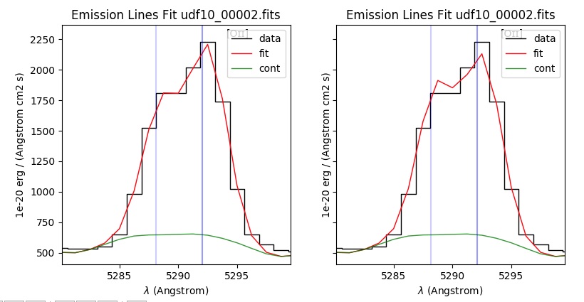

Tutorial
========

This tutorial show how to use pyplatefit to perform continuum and emission line

.. _basic:

Basic usage
+++++++++++

.. code::

   from pyplatefit import fit_spec
   from mpdaf.obj import Spectrum
   sp = Spectrum('test_data/udf10_00002.fits')
   z = 0.41892
   res = fit_spec(sp, z)

::

[DEBUG] Getting lines from get_emlines...
[DEBUG] 21.3 % of the spectrum is used for fitting.
[DEBUG] 22 all lines to fit
[DEBUG] Leastsq fitting with ftol: 1e-06 xtol: 1e-04 maxfev: 1000
[DEBUG] Fit succeeded. after 284 iterations, redChi2 = 19.921
[DEBUG] Getting lines from get_emlines...
[DEBUG] 21.2 % of the spectrum is used for fitting.
[DEBUG] 9 balmer lines to fit
[DEBUG] 13 forbidden lines to fit
[DEBUG] No resonnant lines to fit
[DEBUG] Leastsq fitting with ftol: 1e-06 xtol: 1e-04 maxfev: 1000
[DEBUG] Fit succeeded. after 163 iterations, redChi2 = 14.342

.. note::

   It is possible to use directly the ``sp.fit_lines()`` method to get the same
   results without the need to import pyplatefit.
   
.. code::

   from mpdaf.obj import Spectrum
   sp = Spectrum('test_data/udf10_00002.fits')
   z = 0.41892
   res = sp.fit_lines(z)
   
The ``res`` dictionary contains all the fit results. Consult the API documentation
for the full description.

Let's first display the results of the fit:

.. code::

   import matplotlib.pyplot as plt
   fig,ax = plt.subplots(1,2) 
   sp.plot(ax=ax[0])
   res['cont'].plot(ax=ax[0], color='r')
   res['line'].plot(ax=ax[1])
   res['linefit'].plot(ax=ax[1], color='r')
   plt.show()
   
.. image:: images/high_fig1.png

One can see on the left, the continuum fit and on the right, the line emission fit of
the continuum subtracted spectrum.

The results are saved into tow tables: ``ztable`` and ``linetable`` which contain
respectively the redshift information for each line **family** and the individual line
fitting information.

.. note::

   A line **family** is defined by a set of lines which have all the same velocity offset
   with respect to the input redshift and the same velocity dispersion. Typical families
   are: all, balmer, forbidden, lyalpha and other resonant lines such as MgII doublet.
   
    
.. code::

   res['ztable']
   
will write the following:

::

  <Table masked=True length=3>
  FAMILY    VEL   ERR_VEL    Z     Z_ERR    Z_INIT  VDISP  VDISP_ERR  SNRMAX  SNRSUM SNRSUM_CLIPPED   NL  NL_CLIPPED
  str20   float64 float64 float64 float64  float64 float64  float64  float64 float64    float64     int64   int64
  --------- ------- ------- ------- -------- ------- ------- --------- ------- ------- -------------- ----- ----------
        all   85.87    0.88 0.41921 2.92e-06 0.41892   65.99      0.98   75.42  126.25         126.17    22         16
     balmer   25.99    0.88 0.41929 2.95e-06 0.41921   64.74      0.98   88.58  109.44         109.43     9          8
  forbidden   30.37    1.24 0.41931 4.13e-06 0.41921   65.53      1.42   48.35   91.64          91.61    13          9

The first row show the result of the first line fitting iteration. All available lines
have been fitted together with a unique velocity offset and velocity dispersion.
The second iteration is shown in the next two rows. The resulting redshift has been used
as initial value and the two different families, balmer and forbidden, have been fitted
separately. The resulting redshifts and velocity dispersion are reported here.

Some statistical information is also given such as the number, sum and maximum SNR of 
all lines for each family.

.. Note::

   Redshift are given in vacuum and all given values are given in rest frame, except
   if specified. The velocity dispersion is the intrinsic value, corrected by the
   instrumental LSF, except if the option ``lsf=False`` is used.
   
.. code::

   res['linetable']
   
will write the following:

::

 <Table masked=True length=44>
   FAMILY     LINE   LBDA_REST  DNAME    VEL   VEL_ERR    Z     Z_ERR    Z_INIT  VDISP  VDISP_ERR   FLUX   FLUX_ERR   SNR     SKEW  SKEW_ERR LBDA_OBS PEAK_OBS FWHM_OBS  VDINST   EQW   EQW_ERR CONT_OBS   CONT  CONT_ERR
   str20     str20    float32  bytes10 float64 float64 float64 float64  float64 float64  float64  float64  float64  float64 float64 float64  float64  float64  float64  float64 float64 float64 float64  float64 float64
 --------- --------- --------- ------- ------- ------- ------- -------- ------- ------- --------- -------- -------- ------- ------- -------- -------- -------- -------- ------- ------- ------- -------- ------- --------
       all   NEV3427   3426.85     Neᴠ   85.87    0.88 0.41921 2.92e-06 0.41892   65.99      0.98     1.46   138.74    0.01      --       --  4862.05     0.37     3.68   70.34   -0.00    0.17   574.57  815.27    30.12
       all   OII3727   3727.09    None   85.87    0.88 0.41921 2.92e-06 0.41892   65.99      0.98  4190.92   115.67   36.23      --       --  5288.04  1046.45     3.76   62.05   -5.01    0.16   589.73  836.78    41.88
       all   OII3729   3729.88   [Oɪɪ]   85.87    0.88 0.41921 2.92e-06 0.41892   65.99      0.98  6171.63   117.26   52.63      --       --  5292.00  1540.67     3.76   61.98   -7.32    0.17   593.92  842.73    42.22
       all       H11    3771.7     H11   85.87    0.88 0.41921 2.92e-06 0.41892   65.99      0.98   189.90   111.83    1.70      --       --  5351.33    47.24     3.78   60.96   -0.20    0.12   678.39  962.58    46.23
       all       H10   3798.98     H10   85.87    0.88 0.41921 2.92e-06 0.41892   65.99      0.98   314.74   108.55    2.90      --       --  5390.04    78.11     3.79   60.32   -0.32    0.11   700.12  993.41    41.11
       all        H9   3836.47      H9   85.87    0.88 0.41921 2.92e-06 0.41892   65.99      0.98   565.71   107.52    5.26      --       --  5443.23   139.94     3.80   59.45   -0.54    0.10   744.95 1057.03    40.19
       all NEIII3870   3870.16 [Neɪɪɪ]   85.87    0.88 0.41921 2.92e-06 0.41892   65.99      0.98   402.85   107.54    3.75      --       --  5491.03    99.35     3.81   58.69   -0.38    0.10   752.97 1068.41    38.28
       all   HEI3890   3889.73    None   85.87    0.88 0.41921 2.92e-06 0.41892   65.99      0.98  1347.71   427.52    3.15      --       --  5518.79   331.78     3.82   58.26   -1.23    0.40   771.42 1094.59    63.25
       all        H8   3890.15      H8   85.87    0.88 0.41921 2.92e-06 0.41892   65.99      0.98     0.06   427.89    0.00      --       --  5519.39     0.02     3.82   58.25   -0.00    0.39   770.81 1093.72    63.27
       all NEIII3967   3968.91    None   85.87    0.88 0.41921 2.92e-06 0.41892   65.99      0.98   375.23   115.66    3.24      --       --  5631.14    91.69     3.85   56.57   -0.33    0.10   802.90 1139.25    59.16
       all  HEPSILON    3971.2      Hε   85.87    0.88 0.41921 2.92e-06 0.41892   65.99      0.98   962.32   114.98    8.37      --       --  5634.39   235.09     3.85   56.53   -0.84    0.10   805.59 1143.07    59.02
       ...       ...       ...     ...     ...     ...     ...      ...     ...     ...       ...      ...      ...     ...     ...      ...      ...      ...      ...     ...     ...     ...      ...     ...      ...
    balmer    HDELTA   4102.89      Hδ   25.99    0.88 0.41929 2.95e-06 0.41921   64.74      0.98  2117.37    90.39   23.42      --       --  5821.59   516.25     3.85   53.93   -1.81    0.08   824.48 1170.11    20.39
    balmer    HGAMMA   4341.68      Hγ   25.99    0.88 0.41929 2.95e-06 0.41921   64.74      0.98  3837.99    82.96   46.26      --       --  6160.41   912.22     3.95   49.80   -3.45    0.08   784.55 1113.44    25.85
 forbidden  OIII4364   4364.44    None   30.37    1.24 0.41931 4.13e-06 0.41921   65.53      1.42     7.41    81.62    0.09      --       --  6192.77     1.74     3.99   49.44   -0.01    0.07   798.15 1132.74    25.99
    balmer     HBETA   4862.68      Hβ   25.99    0.88 0.41929 2.95e-06 0.41921   64.74      0.98  8802.49    99.37   88.58      --       --  6899.66  1964.12     4.21   42.93   -8.08    0.11   767.45 1089.17    22.68
 forbidden  OIII4960    4960.3    None   30.37    1.24 0.41931 4.13e-06 0.41921   65.53      1.42   737.56    62.50   11.80      --       --  7038.25   161.12     4.30   41.91   -0.67    0.06   778.03 1104.18    16.09
 forbidden  OIII5008   5008.24  [Oɪɪɪ]   30.37    1.24 0.41931 4.13e-06 0.41921   65.53      1.42  2299.99    64.36   35.73      --       --  7106.27   499.27     4.33   41.44   -2.11    0.06   769.86 1092.60    15.74
 forbidden   HEI5877   5877.25    None   30.37    1.24 0.41931 4.13e-06 0.41921   65.53      1.42   899.50   107.50    8.37      --       --  8339.33   173.20     4.88   35.41   -0.88    0.11   724.00 1027.50    48.95
 forbidden    OI6302   6302.05    [Oɪ]   30.37    1.24 0.41931 4.13e-06 0.41921   65.53      1.42   717.22   223.90    3.20      --       --  8942.09   130.07     5.18   33.85   -0.74    0.24   680.39  965.62    81.93
 forbidden   NII6550   6549.85    None   30.37    1.24 0.41931 4.13e-06 0.41921   65.53      1.42  4478.01   163.27   27.43      --       --  9293.70   784.21     5.36   33.26   -4.57    0.18   690.13  979.44    28.15
    balmer    HALPHA   6564.61      Hα   25.99    0.88 0.41929 2.95e-06 0.41921   64.74      0.98 23620.83   679.14   34.78      --       --  9314.54  4167.63     5.32   33.23  -24.00    0.86   693.54  984.27    66.01
 forbidden   NII6585   6585.28    None   30.37    1.24 0.41931 4.13e-06 0.41921   65.53      1.42 11571.15   239.33   48.35      --       --  9343.97  2016.34     5.39   33.19  -11.76    0.68   693.33  983.98   291.67

When error estimation is important, it is recommended to use the option ``emcee=True``.
After a first least-square fit a second minimisation is performed using Bayesian 
sampling of the posterior distribution with the EEMC 
routine of ``lmfit``. This will give a better estimate of errors, but note that it is
computationally expensive.

.. code::

   sp = Spectrum('test_data/udf10_00053.fits')
   z = 4.77666
   res = fit_spec(sp, z, emcee=True)
   
   
::

  [DEBUG] First iteration: Continuum and Line fit without line family selection except for lyman-alpha
  [DEBUG] Getting lines from get_emlines...
  [DEBUG] 6.8 % of the spectrum is used for fitting.
  [DEBUG] 4 all lines to fit
  [DEBUG] Lyman alpha asymetric line fit
  [DEBUG] Leastsq fitting with ftol: 1e-06 xtol: 1e-04 maxfev: 1000
  [DEBUG] Fit succeeded. after 108 iterations, redChi2 = 2.960
  [DEBUG] Error estimation using EMCEE with nsteps: 1000 nwalkers: 30 burn: 20
  [DEBUG] End EMCEE after 30000 iterations, redChi2 = 2.953
  [DEBUG] Second iteration: Line fit for each line family
  [DEBUG] Getting lines from get_emlines...
  [DEBUG] 6.8 % of the spectrum is used for fitting.
  [DEBUG] No balmer lines to fit
  [DEBUG] 4 forbidden lines to fit
  [DEBUG] No resonnant lines to fit
  [DEBUG] Lyman alpha asymetric line fit
  [DEBUG] Leastsq fitting with ftol: 1e-06 xtol: 1e-04 maxfev: 1000
  [DEBUG] Fit succeeded. after 129 iterations, redChi2 = 2.974
  [DEBUG] Error estimation using EMCEE with nsteps: 1000 nwalkers: 30 burn: 20
  [DEBUG] End EMCEE after 30000 iterations, redChi2 = 2.958
   	
   	
Note that it is possible to change the default parameters using the ``linepars`` dictionary.
See ``Linefit`` class documentation.

.. _advanced:

Advanced usage
++++++++++++++

While the basic usage will be convenient for most application, it is sometimes useful
to use directly the ``Platefit`` python class. We give a few examples below.

Step by step process
--------------------
.. code::

   from pyplatefit import Platefit
   pf = Platefit()
   
The platefit object has various associated methods.

.. code::

   res_cont = pf.fit_cont(sp, z, vdisp=80)
   pf.info_cont(res_cont)

::

  [INFO] Spectrum: test_data/udf10_00002.fits
  [INFO] Cont fit status: Continuum fit successful
  [INFO] Cont Init Z: 0.41892
  [INFO] Cont Fit Metallicity: 0.00400
  [INFO] Cont Fit E(B-V): 1.17
  [INFO] Cont Chi2: 0.05
  
.. code::

   import matplotlib.pyplot as plt
   fig,ax = plt.subplots(1,1)
   pf.plot_cont(ax, res_cont)
   
.. image:: images/adv_fig1.png  

The final continuum (in blue) and the first fitted value (in red) are displayed.

The line fitting can now be done on the continuum subtracted spectrum.

.. code:: 

   res_line = pf.fit_lines(res_cont['line_spec'], z)
   
::

  [DEBUG] Getting lines from get_emlines...
  [DEBUG] 21.3 % of the spectrum is used for fitting.
  [DEBUG] 9 balmer lines to fit
  [DEBUG] 13 forbidden lines to fit
  [DEBUG] No resonnant lines to fit
  [DEBUG] Leastsq fitting with ftol: 1e-06 xtol: 1e-04 maxfev: 1000
  [DEBUG] Fit succeeded. after 277 iterations, redChi2 = 19.285 

A detailed fit report can be obtained as follows:
  
.. code::

    pf.info_lines(res_line, full_output=True)
    
::

  [INFO] Line Fit (LSQ) Status: 2 Fit succeeded. Niter: 277
  [INFO] Line Fit RedChi2: 19.29 Bic: 2463.97
  [INFO]   FAMILY   VEL  ERR_VEL    Z     Z_ERR    Z_INIT VDISP VDISP_ERR SNRMAX SNRSUM SNRSUM_CLIPPED  NL NL_CLIPPED
  --------- ----- ------- ------- -------- ------- ----- --------- ------ ------ -------------- --- ----------
     balmer 82.67    1.08 0.41920 3.59e-06 0.41892 65.85      1.19  74.19  90.85          90.83   9          7
  forbidden 92.19    1.47 0.41923 4.90e-06 0.41892 66.45      1.67  50.76  85.31          85.24  13          9
  [[Fit Statistics]]
    # fitting method   = leastsq
    # function evals   = 277
    # data points      = 783
    # variables        = 26
    chi-square         = 14599.0340
    reduced chi-square = 19.2853817
    Akaike info crit   = 2342.72753
    Bayesian info crit = 2463.96898
  [[Variables]]
    dv_balmer:             82.6691559 +/- 1.07630711 (1.30%) (init = 0)
    vdisp_balmer:          65.8497465 +/- 1.18767974 (1.80%) (init = 50)
    H11_gauss_l0:          3771.7 (fixed)
    H11_gauss_flux:        195.261847 +/- 110.000096 (56.33%) (init = 342.9288)
    H10_gauss_l0:          3798.98 (fixed)
    H10_gauss_flux:        321.778291 +/- 106.743772 (33.17%) (init = 343.229)
    H9_gauss_l0:           3836.47 (fixed)
    H9_gauss_flux:         571.587896 +/- 105.764058 (18.50%) (init = 487.2758)
    H8_gauss_l0:           3890.15 (fixed)
    H8_gauss_flux:         1.60118526 +/- 827.407903 (51674.71%) (init = 1106.904)
    HEPSILON_gauss_l0:     3971.2 (fixed)
    HEPSILON_gauss_flux:   961.129029 +/- 115.487400 (12.02%) (init = 944.1861)
    HDELTA_gauss_l0:       4102.89 (fixed)
    HDELTA_gauss_flux:     2047.79851 +/- 105.351858 (5.14%) (init = 1652.118)
    HGAMMA_gauss_l0:       4341.68 (fixed)
    HGAMMA_gauss_flux:     3641.52927 +/- 96.8861542 (2.66%) (init = 2994.66)
    HBETA_gauss_l0:        4862.68 (fixed)
    HBETA_gauss_flux:      8573.85524 +/- 115.563484 (1.35%) (init = 7094.975)
    HALPHA_gauss_l0:       6564.61 (fixed)
    HALPHA_gauss_flux:     23615.1470 +/- 810.960242 (3.43%) (init = 18925.8)
    dv_forbidden:          92.1947914 +/- 1.46861341 (1.59%) (init = 0)
    vdisp_forbidden:       66.4497326 +/- 1.66738369 (2.51%) (init = 50)
    NEV3427_gauss_l0:      3426.85 (fixed)
    NEV3427_gauss_flux:    1.58386493 +/- 152.583744 (9633.63%) (init = 122.0336)
    OII3727_gauss_l0:      3727.09 (fixed)
    OII3727_gauss_flux:    4337.38518 +/- 117.028889 (2.70%) (init = 5589.116)
    OII3729_gauss_l0:      3729.88 (fixed)
    OII3729_gauss_flux:    6066.01921 +/- 119.506275 (1.97%) (init = 5589.543)
    NEIII3870_gauss_l0:    3870.16 (fixed)
    NEIII3870_gauss_flux:  401.552193 +/- 106.029812 (26.40%) (init = 1106.026)
    HEI3890_gauss_l0:      3889.73 (fixed)
    HEI3890_gauss_flux:    1360.20799 +/- 597.311542 (43.91%) (init = 1106.885)
    NEIII3967_gauss_l0:    3968.91 (fixed)
    NEIII3967_gauss_flux:  355.551570 +/- 116.469120 (32.76%) (init = 944.0853)
    OIII4364_gauss_l0:     4364.44 (fixed)
    OIII4364_gauss_flux:   27.4910860 +/- 95.0586426 (345.78%) (init = 2999.618)
    OIII4960_gauss_l0:     4960.3 (fixed)
    OIII4960_gauss_flux:   653.336250 +/- 72.8660750 (11.15%) (init = 518.4111)
    OIII5008_gauss_l0:     5008.24 (fixed)
    OIII5008_gauss_flux:   2213.55293 +/- 74.8235022 (3.38%) (init = 1743.79)
    HEI5877_gauss_l0:      5877.25 (fixed)
    HEI5877_gauss_flux:    905.255668 +/- 125.924358 (13.91%) (init = 1252.933)
    OI6302_gauss_l0:       6302.05 (fixed)
    OI6302_gauss_flux:     713.970089 +/- 261.547427 (36.63%) (init = 922.5347)
    NII6550_gauss_l0:      6549.85 (fixed)
    NII6550_gauss_flux:    4498.73520 +/- 189.972748 (4.22%) (init = 18888.22)
    NII6585_gauss_l0:      6585.28 (fixed)
    NII6585_gauss_flux:    11595.4885 +/- 279.302239 (2.41%) (init = 18978.6)
  [[Correlations]] (unreported correlations are < 0.100)
    C(H8_gauss_flux, HEI3890_gauss_flux)         =  0.984
    C(HEPSILON_gauss_flux, NEIII3967_gauss_flux) = -0.415
    C(vdisp_forbidden, NII6585_gauss_flux)       =  0.390
    C(vdisp_balmer, HBETA_gauss_flux)            =  0.327
    C(dv_forbidden, OII3727_gauss_flux)          =  0.272
    C(vdisp_forbidden, OIII5008_gauss_flux)      =  0.271
    C(OII3727_gauss_flux, OII3729_gauss_flux)    = -0.249
    C(dv_balmer, HBETA_gauss_flux)               =  0.229
    C(dv_balmer, HALPHA_gauss_flux)              = -0.226
    C(vdisp_forbidden, OII3729_gauss_flux)       =  0.226
    C(vdisp_balmer, HGAMMA_gauss_flux)           =  0.225
    C(dv_forbidden, OII3729_gauss_flux)          = -0.219
    C(vdisp_forbidden, NII6550_gauss_flux)       =  0.149
    C(H8_gauss_flux, dv_forbidden)               =  0.146
    C(dv_forbidden, HEI3890_gauss_flux)          =  0.144
    C(OIII5008_gauss_flux, NII6585_gauss_flux)   =  0.106
    C(vdisp_balmer, HDELTA_gauss_flux)           =  0.105   
    
The corresponding plot can be displayed with the following command:

.. code::

   pf.plot_lines(ax, res_line)
   
.. image:: images/adv_fig2.png  

To compute the Equivalent Width one can use:

.. code::
   
   line_table = res_line.linetable
   pf.comp_eqw(sp, res_cont['line_spec'], z, line_table)
   
``line_table`` is now completed with EQW and EQW_ERR columns.

Adjusting line ratio constrains for doublet
-------------------------------------------

In this example, we show how to impose line ratio constrain on line doublets.

.. code::

   ratio1 = line_table.loc['OII3729']['FLUX'] / line_table.loc['OII3727']['FLUX']
   
This gives 1.398 as line ratio. Let's assume that we want to limit this ratio to 1.2.

.. code::

   line_ratios = [("OII3727", "OII3729", 1.0, 1.2)]
   pf = Platefit(linepars=dict(line_ratios=line_ratios))
   res = pf.fit(sp, z, use_line_ratios=True, emcee=True)
   line_table = res['linetable']
   ratio2 = line_table.loc['OII3729']['FLUX'] / line_table.loc['OII3727']['FLUX']
   
The fitted line ratio value is now 1.199. Note that we have used the ``emcee`` method
to get a reliable estimate of the errors and the parameters. We also used the
``fit`` method of Platefit which does continuum and line fitting in one command.

To check the results, we can use the plot method.

.. code::

   fig,ax = plt.subplots(1,2, sharey=True, sharex=True)
   res0 = pf.fit(sp, z, use_line_ratios=False, emcee=True)
   pf.plot(ax[0], res0)
   pf.plot(ax[1], res)
   

